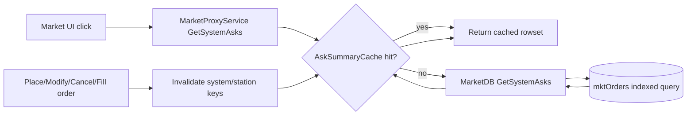

# Optimize `GetSystemAsks` Stall

## Goal
Reduce `marketProxy::GetSystemAsks()` response time from multi-second blocking to sub-200ms typical, and avoid whole-server hitching during market category/detail interactions.

## Current hot path
- Service call: [c:\evemu_Crucible-master\src\eve-server\market\MarketProxyService.cpp](c:\evemu_Crucible-master\src\eve-server\market\MarketProxyService.cpp)
  - `GetSystemAsks()` directly calls `MarketDB::GetSystemAsks(call.client->GetSystemID())`.
- DB query: [c:\evemu_Crucible-master\src\eve-server\market\MarketDB.cpp](c:\evemu_Crucible-master\src\eve-server\market\MarketDB.cpp)
  - Current SQL groups by `typeID` with `MIN(price)` but also selects non-aggregated `volRemaining, stationID` and does not filter `bid`.
- Cache behavior (related load spikes): [c:\evemu_Crucible-master\src\eve-server\cache\ObjCacheService.cpp](c:\evemu_Crucible-master\src\eve-server\cache\ObjCacheService.cpp)
  - Cache misses are synchronous and can generate heavy objects in-request.

## Key issues to address
- **Query correctness + work set**
  - `GetSystemAsks` should only operate on sell orders (`bid=Sell`).
  - Mixed aggregate/non-aggregate columns can force expensive temp/sort behavior and can return mismatched rows.
- **No endpoint cache**
  - Every market click can hit DB for the same system repeatedly.
- **Likely index mismatch**
  - Grouped/ordered queries over `mktOrders` need composite indexes aligned to filter and aggregation columns.

## Optimization strategy

### 1) Correct and slim SQL for system asks
- Update [c:\evemu_Crucible-master\src\eve-server\market\MarketDB.cpp](c:\evemu_Crucible-master\src\eve-server\market\MarketDB.cpp):
  - Add `bid = Market::Type::Sell` in `GetSystemAsks` and `GetStationAsks`.
  - Replace ambiguous aggregate select with deterministic strategy:
    - either return only `(typeID, minPrice)` for summary rows, or
    - join/subquery to fetch the full row matching min price per type.
- Keep response shape compatible with current consumer expectations.

### 2) Add DB indexes for market hot paths
- Add migration under `sql/migrations/` for `mktOrders`:
  - index for system asks pattern: `(solarSystemID, bid, typeID, price)`
  - index for station asks pattern: `(stationID, bid, typeID, price)`
  - verify existing indexes before adding to avoid redundancy.
- Validate with DB EXPLAIN in local/dev environment.

### 3) Introduce short-TTL cache for asks summaries
- In [c:\evemu_Crucible-master\src\eve-server\market\MarketProxyService.cpp](c:\evemu_Crucible-master\src\eve-server\market\MarketProxyService.cpp):
  - Add object-cache-style key per `(systemID)` for `GetSystemAsks`, and `(stationID)` for `GetStationAsks`.
  - TTL target: 3-10 seconds (configurable) to collapse burst clicks.
- In market order mutation flows (place/modify/cancel/fill), invalidate affected cache keys.

### 4) Add lightweight timing instrumentation
- Add scoped timing logs around `GetSystemAsks` and `MarketDB::GetSystemAsks`.
- Capture at least:
  - DB query ms
  - total handler ms
  - row count returned
- Emit warn logs for slow calls (e.g., >250ms).

### 5) Validate against regression + load
- Functional checks:
  - category click loads correctly
  - asks contain sell-side-only entries
  - no broken market UI assumptions from row-shape changes
- Performance checks:
  - rapid repeated category opens in same system
  - multiple concurrent clients opening market
  - compare p50/p95 before vs after.

## Rollout order
1. Instrumentation first (baseline).
2. SQL correctness and index migration.
3. Cache + invalidation.
4. Re-measure and tune TTL/indexes.

## Architecture view

